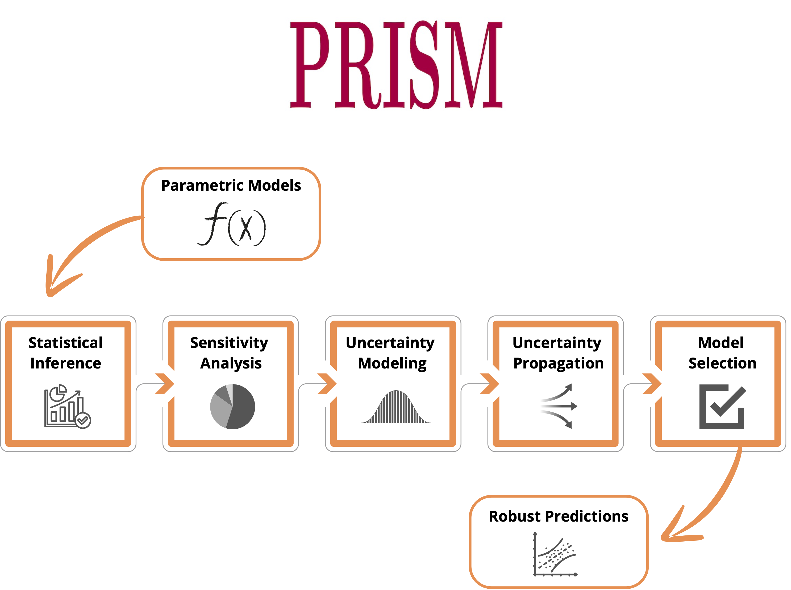

## Probabilistic Remaining-life Inference for Structural Materials

**PRISM: Probabilistic Remaining-life Inference for Structural Materials** is an open-source Python framework that implements the five-step uncertainty-quantification (UQ) workflow for probabilistic prediction of remaining useful life (RUL) in structural materials. It delivers robust, statistically-defensible predictions of RUL for components governed by creep, fatigue, or other time-dependent degradation mechanisms.

<p align="center">

</p>

### Table of Contents
- [Overview](#overview)
- [Features](#features)
- [Usage](#usage)
- [Documentation](#documentation)
- [Reproducibility](#reproducibility)
- [Authors](#authors)
- [Citing PRISM](#citing-prism)
- [License](#license)
- [Institutional support](#institutional-support)
- [Funding](#funding)

### Overview

PRISM targets engineers and scientists who must **characterise lifetime variability** instead of quoting a single deterministic “safety factor”. 

The default implementation ships with three classical time–temperature–parameter (TTP) creep models – Larson-Miller, Orr-Sherby-Dorn and Manson-Succop – wrapped in a uniform probabilistic interface. Because the code is modular, any analytical or data-driven lifetime model can be plugged into the pipeline. The underlying results are reported in the following publication:
- *V.V. Maudonet, C.F.T. Matt and A. Cunha~Jr, A framework for probabilistic prediction of remaining useful life in structural materials, 2025 (under review)*

Preprint available here.

### Features
- End-to-end UQ pipeline for lifetime prediction (creep & fatigue ready)  


### Usage
To get started with **PRISM**, follow these steps:
1. Clone the repository:
   
bash
   git clone https://github.com/americocunhajr/PRISM.git

2. Navigate to the code directory:
   
bash
   cd PRISM/PRISM-1.0

3. Execute the main file:
   
bash
   XXX

### Documentation
The routines in **PRISM** are well-commented to explain their functionality. Each routine includes a description of its purpose, inputs, and outputs. 

### Reproducibility

Simulations done with **PRISM** are fully reproducible, as can be seen on this <a href="https://codeocean.com/capsule/XXX/" target="_blank">CodeOcean capsule</a>.

### Authors
- Victor Vieira Maudonet (UERJ)
- Carlos Frederico Trota Matt (CEPEL)
- Americo Cunha Jr (LNCC / UERJ)

### Citing PRISM
We ask the package users to cite the following manuscript in any publications reporting work done with our code or data:
- *V.V. Maudonet, C.F.T. Matt and A. Cunha~Jr, A framework for probabilistic prediction of remaining useful life in structural materials, 2025 (under review)*

```
@article{Maudonet2025PRISM,
   author  = {V.V. Maudonet and C.F.T. Matt and A. {Cunha~Jr}},
   title   = {A framework for probabilistic prediction of remaining useful life in structural materials},
   journal = {Under Review},
   year    = {2025},
   volume  = {~},
   pages   = {~},
   doi    = {~},
}
```

### License
**PRISM** is released under the MIT license. See the LICENSE file for details. All new contributions must be made under the MIT license.

 

### Institutional support

 &nbsp; &nbsp; &nbsp;  &nbsp; &nbsp; &nbsp; 

### Funding

 &nbsp; &nbsp;   &nbsp; &nbsp; &nbsp;  &nbsp; &nbsp; &nbsp; 
